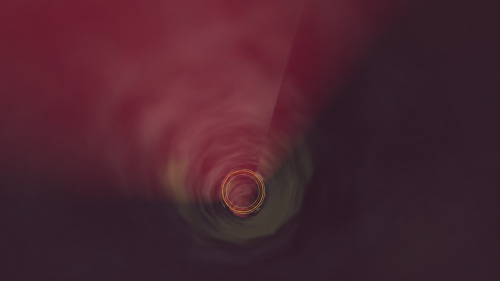
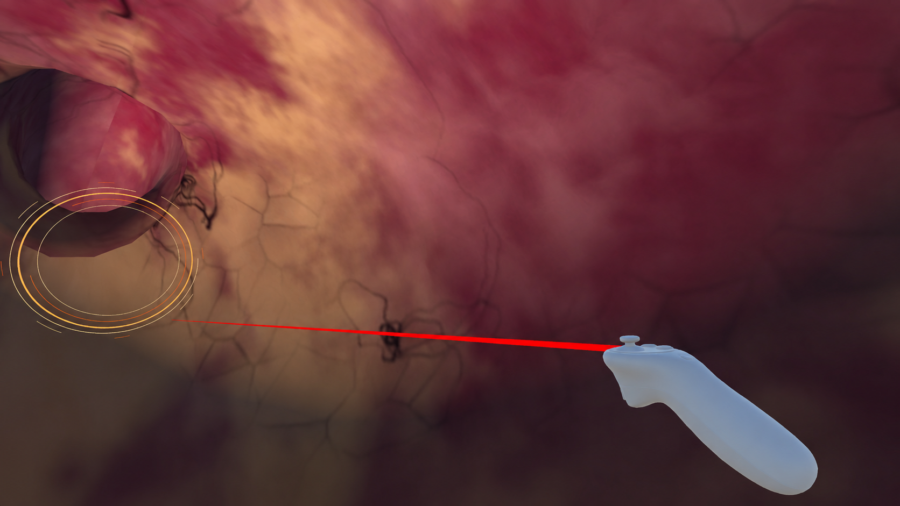
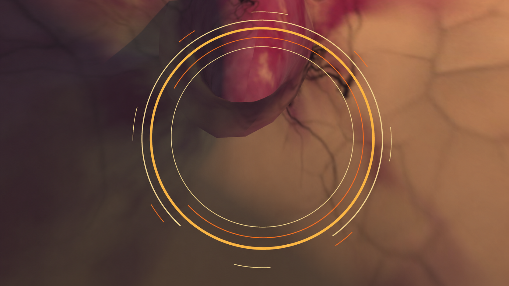
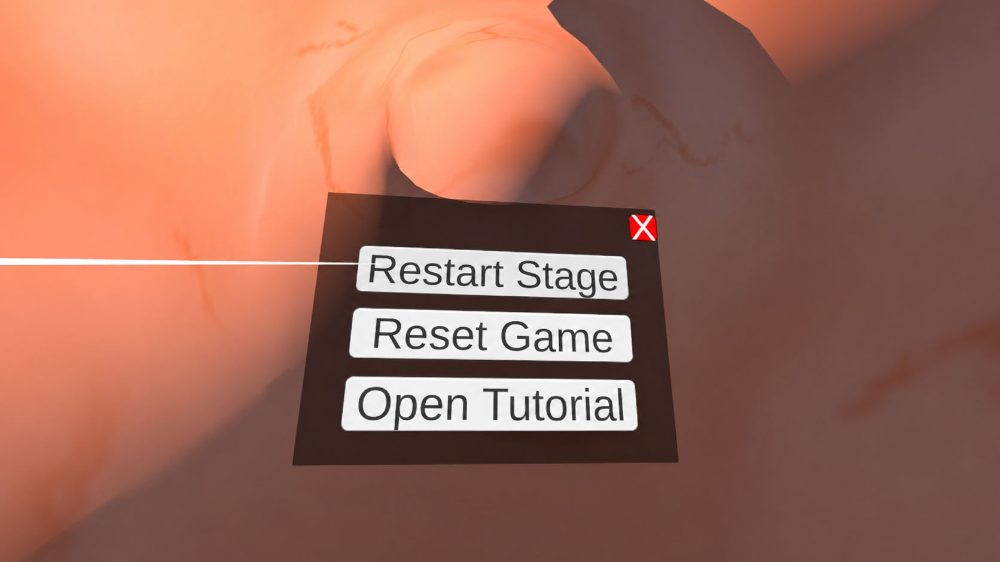

# VR AI Interactive Experience

**Meta Quest VR에서 사용자의 음성 질문을 AI 응답으로 연결한 Unity/C# 기반 인터랙티브 콘텐츠**

세종대학교 AR/VR/MR 수업에서 진행한 4인 팀 프로젝트입니다. 사용자는 인체 소화기관을 직접 탐험하며 음성으로 질문하고, Unity 클라이언트는 녹음된 음성을 서버로 전달해 **STT → LLM → TTS** 처리 결과를 다시 VR 안에서 음성으로 재생합니다.

이 프로젝트에서 저는 **Unity/C# 인터랙션, 오디오 데이터 처리, 클라이언트-서버 통신, XR 이동 로직과 Python AI 서버를 하나의 사용자 경험으로 연결하는 역할**을 담당했습니다.

---

## Project Overview

| Item | Description |
| --- | --- |
| Period | 2025.09 – 2025.12 |
| Team | 4인 팀 프로젝트 |
| Role | Unity/C# Interaction & AI Integration · Python AI Server |
| Platform | Meta Quest 2 / Quest 3 |
| Engine | Unity 2023.2.6f1 |
| Core Stack | C# · XR Interaction Toolkit · FastAPI · faster-whisper · Gemini · Edge TTS |

## Experience Gallery

<p align="center">
  
</p>
<p align="center"><sub>소화기관 내부 탐험과 단계별 공간 전환</sub></p>

<p align="center">
  
  
</p>
<p align="center"><sub>XR 컨트롤러 기반 인터랙션 · 스테이지 전환 포인트</sub></p>

<p align="center">
  
</p>
<p align="center"><sub>VR 내부에서 동작하는 스테이지 초기화·복귀·튜토리얼 메뉴</sub></p>

<details>
<summary><b>Additional project screenshots</b></summary>
<br/>
<p align="center">
  
  
</p>
<p align="center">
  
  
  
</p>
</details>

---

## What I Built

| Area | Implementation |
| --- | --- |
| **XR Input** | Meta Quest 컨트롤러 입력과 음성 녹음 시작·종료 연결 |
| **Audio Processing** | `AudioClip` 샘플 추출, gain 보정, 16-bit PCM WAV 직렬화 |
| **Client ↔ Server** | `UnityWebRequest` 기반 multipart 업로드, JSON 응답 처리, MP3 다운로드 |
| **AI Voice Pipeline** | FastAPI에서 faster-whisper STT → Gemini 응답 생성 → Edge TTS 음성 합성 |
| **XR Navigation** | XR Interaction Toolkit 기반 텔레포트, 스테이지 상태 및 복귀 로직 |
| **Runtime State** | Listening / Thinking / Speaking UI와 오류·오디오 상태 제어 |

## System Architecture

```mermaid
flowchart LR
    A[Meta Quest Controller] --> B[Unity Microphone]
    B --> C[AudioClip Processing]
    C --> D[16-bit PCM WAV]
    D --> E[UnityWebRequest<br/>multipart/form-data]
    E --> F[FastAPI<br/>POST /ask_audio]
    F --> G[faster-whisper<br/>Korean STT]
    G --> H[Gemini<br/>Response Generation]
    H --> I[Edge TTS<br/>MP3 Generation]
    I --> J[answer + audio_url]
    J --> K[Unity Audio Download]
    K --> L[AudioSource Playback]
```



### Interaction Flow

1. Meta Quest 컨트롤러 입력으로 음성 녹음을 시작·종료합니다.
2. Unity `AudioClip`에서 실제 녹음 구간을 추출하고 gain 보정 후 16-bit PCM WAV로 직렬화합니다.
3. `UnityWebRequest`가 WAV 파일을 `multipart/form-data`로 FastAPI 서버에 전송합니다.
4. 서버가 faster-whisper로 한국어 음성을 텍스트로 변환합니다.
5. Gemini가 질문에 맞는 인체 설명 응답을 생성합니다.
6. Edge TTS가 응답을 MP3로 변환하고 서버가 `answer`와 `audio_url`을 반환합니다.
7. Unity가 생성 음성을 다운로드해 `AudioSource`로 재생하고 상호작용 상태 UI를 갱신합니다.

---

## My Contribution

### Unity / C# — XR Interaction & Client Integration

- **Meta Quest 입력과 음성 인터랙션 연결**  
  XR Input Action을 녹음 시작/종료 동작에 연결하고, 컨트롤러 입력이 실제 AI 질의 흐름으로 이어지도록 구현했습니다.

- **Unity 오디오 데이터 처리**  
  녹음 종료 시점의 실제 샘플 길이를 기준으로 `AudioClip` 데이터를 추출하고, gain 보정 및 clipping 방지 후 16-bit PCM WAV 데이터를 생성했습니다.

- **Unity ↔ FastAPI 네트워크 통신 구현**  
  `UnityWebRequest` 기반 multipart 업로드, HTTP 오류 처리, JSON 응답 파싱, 상대/절대 음성 URL 처리, MP3 다운로드 및 재생 흐름을 구현했습니다.

- **비동기 상호작용 상태 관리**  
  음성 입력 → 서버 처리 → 답변 재생의 흐름을 `Listening / Thinking / Speaking` UI 상태로 연결하고, 요청 실패·잘못된 응답·음성 다운로드 실패 상황을 사용자 상태와 연동했습니다.

- **XR 텔레포트 및 스테이지 진행 로직 구현**  
  XR Interaction Toolkit을 활용해 소화기관 탐험 단계 간 텔레포트와 현재 스테이지 상태를 관리하고, 이동 안내 음성과 AI 응답 음성이 겹치지 않도록 오디오 상태를 제어했습니다.

### Python — AI Voice Pipeline

- FastAPI 기반 음성 질의 API `POST /ask_audio` 구현
- 요청 음성 파일 처리와 STT → LLM → TTS 파이프라인 구성
- faster-whisper 기반 한국어 음성 인식
- Gemini API 기반 질문 응답 생성
- Edge TTS 기반 음성 합성 및 MP3 정적 리소스 제공
- Unity 클라이언트와 서버 사이의 요청/응답 규격 연결 및 통합 디버깅

---

## Engineering Highlights

### 1. Unity 런타임과 AI 서비스 사이의 데이터 경계 설계

Unity 내부의 `AudioClip`을 그대로 넘기지 않고, 실제 녹음 길이만큼 샘플을 추출한 뒤 **RIFF/WAVE 규격의 16-bit PCM**으로 직렬화했습니다. Unity 오디오 데이터와 Python STT 서버 사이의 입력 형식을 명확하게 정의해 서로 다른 런타임을 연결했습니다.

### 2. API 호출을 실제 사용자 인터랙션으로 확장

단순히 Gemini API를 호출하는 데 그치지 않고 **입력 장치 → 오디오 처리 → HTTP 요청 → STT → LLM → TTS → 미디어 다운로드 → VR 재생**까지 전체 경로를 직접 연결했습니다. 클라이언트와 서버 양쪽을 구현해 시스템 경계에서 발생하는 문제를 추적하고 수정할 수 있었습니다.

### 3. XR 진행 상태와 오디오 상태의 충돌 제어

VR에서는 이동 안내 음성, 사용자 녹음, AI 생성 음성이 같은 경험 안에서 연속적으로 발생합니다. 새로운 음성 상호작용이나 스테이지 이동 시 기존 재생 소스를 정리해 여러 오디오가 동시에 재생되지 않도록 제어했습니다.

### 4. 텍스트 응답과 음성 리소스를 분리한 응답 구조

서버는 생성된 답변 텍스트와 `audio_url`을 함께 반환하고, Unity는 응답을 받은 뒤 음성 리소스를 별도로 다운로드합니다. AI 처리 결과와 미디어 전달 단계를 분리해 클라이언트가 요청 상태와 재생 상태를 각각 관리할 수 있도록 구성했습니다.

---

## Representative Implementations

| Source | Responsibility |
| --- | --- |
| [`Assets/MicRecorder.cs`](./Assets/MicRecorder.cs) | 마이크 녹음, 샘플 가공, WAV 변환 호출, HTTP 요청, JSON 처리, 생성 음성 다운로드/재생 |
| [`Assets/MicRecoderInput.cs`](./Assets/MicRecoderInput.cs) | XR Input Action과 녹음 시작/종료 연결 |
| [`Assets/WavUtility.cs`](./Assets/WavUtility.cs) | `AudioClip` 데이터를 RIFF/WAVE 규격의 16-bit PCM으로 직렬화 |
| [`Assets/XRTP.cs`](./Assets/XRTP.cs) | XR 텔레포트, 스테이지 상태 갱신, 오디오 전환 제어 |
| [`Assets/nscript/TeleportManager.cs`](./Assets/nscript/TeleportManager.cs) | 현재 스테이지 복귀 및 초기 위치 이동 로직 |
| [`Assets/nscript/VoiceStatusUI.cs`](./Assets/nscript/VoiceStatusUI.cs) | 녹음·처리·재생·오류 상태 UI 관리 |
| [`server/main.py`](./server/main.py) | FastAPI 엔드포인트와 STT/LLM/TTS 파이프라인 orchestration |
| [`server/voice_to_gemini.py`](./server/voice_to_gemini.py) | Gemini 응답 생성, 프롬프트 구성, Edge TTS 음성 파일 생성 |

## Tech Stack

**Client / XR**  
`Unity 2023.2.6f1` · `C#` · `XR Interaction Toolkit 2.5.4` · `OpenXR` · `Oculus XR` · `URP`

**AI / Server**  
`Python` · `FastAPI` · `faster-whisper` · `Gemini API` · `Edge TTS`

**Communication / Data**  
`HTTP` · `multipart/form-data` · `JSON` · `WAV (16-bit PCM)` · `MP3`

## Repository Structure

```text
VR-AI-Interactive-Experience/
├─ Assets/                 # Unity scenes, XR assets, C# interaction logic
│  ├─ MicRecorder.cs
│  ├─ MicRecoderInput.cs
│  ├─ WavUtility.cs
│  ├─ XRTP.cs
│  └─ nscript/
├─ Packages/               # Unity package configuration
├─ ProjectSettings/        # Unity project settings
├─ server/                 # FastAPI / STT / Gemini / TTS server
│  ├─ main.py
│  ├─ voice_to_gemini.py
│  ├─ requirements.txt
│  ├─ .env.example
│  └─ README.md
└─ README.md
```

API key와 로컬 환경 설정은 저장소에 포함하지 않으며, 서버 설정 예시는 [`server/.env.example`](./server/.env.example)에서 확인할 수 있습니다.

## Team & Scope

이 프로젝트는 세종대학교 AR/VR/MR 수업의 **Unity XR 기본 템플릿**을 기반으로 시작한 4인 팀 프로젝트입니다.

제가 담당한 범위는 **Unity/C# 음성 인터랙션, 오디오 처리, 서버 통신, XR 이동/상태 로직, FastAPI 기반 STT·LLM·TTS 파이프라인 및 양쪽 시스템 통합**입니다. 3D 그래픽 에셋 배치와 환경 디자인, 이동 제약을 위한 일부 레벨 콜라이더 구성은 다른 팀원이 담당했습니다.

원본 팀 프로젝트 저장소: `leejaewook-dev/VR-Project---sejong`

---

> **Project Focus — AI 기술을 API 호출에 머무르게 하지 않고, Unity 클라이언트의 입력·상태·네트워크·오디오 시스템과 연결해 실제 인터랙티브 경험으로 구현했습니다.**
